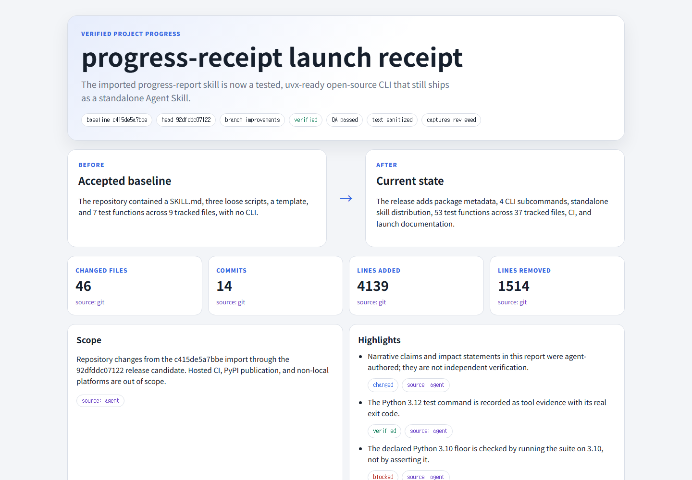

# progress-receipt

Receipts for AI coding: a shareable report of what changed, what passed, what failed, and what nobody checked.



[View the live self-report](examples/self-report/index.html) generated from this repository’s own `demo-before..HEAD` launch work. The committed report also exposes its [sanitized manifest](examples/self-report/manifest.json) and [integrity receipt](examples/self-report/integrity.json); GitHub Pages publication is tracked in [the launch checklist](docs/launch-todo.md).

## Try the zero-config demo

```console
uvx progress-receipt demo
```

The command creates a Git fixture in a temporary directory, runs the real collect → render → accept pipeline, and prints an absolute path to a report you can open. It makes no network calls, reads no files from your project, and runs its fixture with your Git configuration deliberately out of the way, so a global `commit.gpgsign` or `core.hooksPath` cannot change the result. It finishes in about two seconds.

Add `--output DIR` to keep the report somewhere permanent, `--open` to launch it in your browser, or `--quiet` to print only the path. Until the package is published to PyPI, run the checkout directly with `uvx --from . progress-receipt demo`.

## Install the Agent Skill

```console
npx skills@latest add zenovis2-create/progress-receipt --skill visualize-project-progress -g -y
```

The skill is self-contained under [`skills/visualize-project-progress`](skills/visualize-project-progress/): copying that folder is enough. Its collector, renderer, template, evidence contract, and acceptance command do not require the Python package or third-party runtime dependencies.

## Why another artifact?

Each familiar artifact answers only part of the review question:

| Artifact | Useful for | What it cannot establish alone |
| --- | --- | --- |
| Git diff | What bytes changed | Whether the result ran, passed, or was even observed |
| CI status | Whether configured jobs exited successfully | What was not covered, what changed visually, or whether assertions prove the intended behavior |
| Agent summary | A readable interpretation | Independent truth; the author and verifier may be the same system |
| progress-receipt | Change inventory, provenance, evidence links, blockers, and explicit gaps together | Formal correctness or complete secrecy |

The report keeps machine facts and narrative interpretation on the same page without pretending they are the same kind of evidence.

## Evidence model and limitations

The lifecycle is `collect → enrich → verify → render → browser QA → accept`. Collection records a bounded Git range and worktree fingerprint. Enrichment adds claims with explicit `git`, `tool`, `agent`, or `human` provenance. Rendering rejects stale evidence, capture paths that escape the manifest directory or are not really images, and verified claims backed by failed commands; it then publishes an atomic HTML report, sanitized manifest snapshot, reviewed local assets, and SHA-256 integrity receipt. Acceptance rechecks the report, repository identity, branch, range, inventory, worktree, published capture hashes, and last accepted baseline before advancing state.

Claim states stay deliberately separate:

- `changed`: the diff contains a modification, but no verification claim is made.
- `verified`: linked, current evidence passes the report contract.
- `blocked`: a fresh observation records why an outcome could not complete.
- `not_observed`: the report makes the missing observation visible.

These are receipts, not proofs. Exit code zero does not establish semantic correctness. Agent-authored narrative is not independent verification. Sanitization is best-effort and is not a secrecy guarantee. Screenshots are human/agent reviewed rather than automatically sanitized. “Verified” means fresh linked evidence passed this contract, not that the software is formally correct. Read the full [limitations](docs/limitations.md), [threat model](docs/threat-model.md), and [report contract](skills/visualize-project-progress/references/report-contract.md).

## CLI

All runtime code is Python 3.10+ and standard-library only.

```console
progress-receipt collect --repo . --base <ref> --output .progress/draft.json
progress-receipt render --manifest .progress/draft.json --template skills/visualize-project-progress/assets/report-template.html --output .progress/report
progress-receipt accept --repo . --report .progress/report --state .progress/state.json
progress-receipt demo
```

`collect`, `render`, and `accept` delegate to the exact standalone skill scripts packaged in the wheel. The copies under `src/progress_receipt/` are loaders, not duplicated implementations.

## Development

Clone the repository, create an environment if desired, then install and test:

```console
python -m pip install -e .
python -m unittest discover -s tests -v
python -m progress_receipt demo
```

Build and exercise the wheel locally with:

```console
python -m pip wheel . --no-deps --wheel-dir dist
uvx --from . progress-receipt demo
```

The committed launch receipt is reproducible from a clean release-candidate commit with `python tools/generate_self_report.py --output <outside-repo-directory>`. It deliberately renders outside the checkout so the collected worktree fingerprint stays unchanged; copy the sealed directory into `examples/self-report/` only after review and acceptance.

The committed CI workflow runs the full suite and the demo on Ubuntu, macOS, and Windows with Python 3.10 through 3.13. No hosted run has been observed yet, which is why the self-report records that matrix as `not_observed` rather than as a passing check. Release work still requiring external publication is listed in [`docs/launch-todo.md`](docs/launch-todo.md).

MIT licensed. See [LICENSE](LICENSE).
