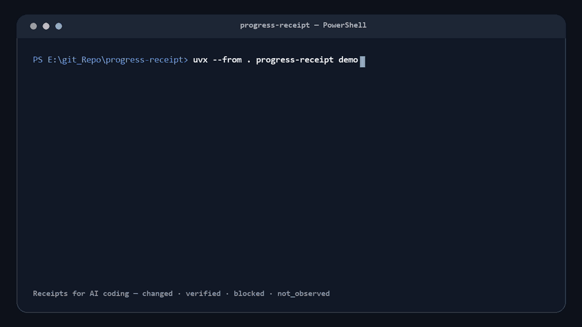

# progress-receipt

**Receipts for AI coding.** See what changed, what was verified, what is blocked, and what nobody checked.

`progress-receipt` turns a bounded Git revision range into a shareable HTML report directory that binds change inventory, claims, command results, and reviewed captures to exact refs and a worktree fingerprint. Machine-derived facts and agent/human interpretation stay labeled by provenance, so reviewers can see both what the report knows and where it stops.



[Inspect the committed self-report](examples/self-report/index.html) generated from this repository’s own bounded launch range. Its [sanitized manifest](examples/self-report/manifest.json) and [integrity receipt](examples/self-report/integrity.json) are committed beside it.

Try the [current synthetic demo](https://zenovis2-create.github.io/progress-receipt/examples/summary-demo/index.html) and its [PR Markdown companion](examples/pr-summary.md). This canned fixture demonstrates the review interface, not verification of this repository's release. The older self-report remains unchanged.

## Run the checkout demo

```console
uvx --from . progress-receipt demo
```

The command creates an isolated canned Git fixture and runs the real collect → render → accept pipeline. Stdout stays one absolute `index.html` path; stderr summarizes the range, four claim states, and linked evidence. The fixture does not inspect another project and runs with global and system Git configuration disabled, so settings such as `commit.gpgsign` or `core.hooksPath` cannot change the result.

Add `--output DIR` to keep the report somewhere permanent, `--open` to launch it in your browser, or `--quiet` to print only the path. After the package is published to PyPI, the shorter `uvx progress-receipt demo` form will run the same command.

## Install a release

Wheel and source distributions are available on [GitHub Releases](https://github.com/zenovis2-create/progress-receipt/releases/latest):

```console
uvx --from https://github.com/zenovis2-create/progress-receipt/releases/download/v0.2.0/progress_receipt-0.2.0-py3-none-any.whl progress-receipt demo
```

PyPI publication is separate and currently requires configuration; do not assume the bare `uvx progress-receipt` command resolves. See [publication status](docs/launch-todo.md).

## Install the Agent Skill

```console
npx skills@latest add zenovis2-create/progress-receipt --skill visualize-project-progress -g -y
```

The skill is self-contained under [`skills/visualize-project-progress`](skills/visualize-project-progress/): copying that folder is enough. Its collector, renderer, template, evidence contract, and acceptance command do not require the Python package or third-party runtime dependencies.

## What the report shows

- `changed`: the diff contains a modification without claiming it was checked.
- `verified`: fresh, linked evidence passed the report contract.
- `blocked`: a current observation records why an outcome could not complete.
- `not_observed`: the report makes an unchecked outcome explicit.

The first screen separates the evidence-package status from counts of individual outcomes. Blocked and unobserved claims appear first, and each claim links directly to its evidence card. Capture cards disclose who recorded the review; this is provenance, not independent authentication. The report does not assess release readiness.

Honest limits are part of the artifact: a successful command is not proof of correctness, text sanitization is best-effort, and captures rely on recorded agent or human review. See the full [limitations](docs/limitations.md), [threat model](docs/threat-model.md), and [report contract](skills/visualize-project-progress/references/report-contract.md).

## Why another artifact?

Each familiar artifact answers only part of the review question:

| Artifact | Useful for | What it cannot establish alone |
| --- | --- | --- |
| Git diff | What bytes changed | Whether the result ran, passed, or was even observed |
| CI status | Whether configured jobs exited successfully | What was not covered, what changed visually, or whether assertions prove the intended behavior |
| Agent summary | A readable interpretation | Independent truth; the author and verifier may be the same system |
| progress-receipt | Change inventory, provenance, evidence links, blockers, and explicit gaps together | Formal correctness or complete secrecy |

The report keeps machine facts and narrative interpretation on the same page without pretending they are the same kind of evidence.

## Evidence model and limitations

The lifecycle is `collect → enrich → verify → render → browser QA → accept`. Collection records a bounded Git range and worktree fingerprint. Enrichment adds claims with explicit `git`, `tool`, `agent`, or `human` provenance. Rendering rejects stale evidence, capture paths that escape the manifest directory or are not really images, and verified claims backed by failed commands; it then publishes an atomic HTML report, sanitized manifest snapshot, reviewed local assets, and SHA-256 integrity receipt. Acceptance rechecks the report, repository identity, branch, range, inventory, worktree, published capture hashes, and last accepted baseline before advancing state.

The four claim states above stay deliberately separate from report-level status.

`report.status: verified` is compatible with blocked claims: it says the evidence shown in the report was successfully validated, not that every outcome is known or unblocked.

These are receipts, not proofs. Exit code zero does not establish semantic correctness. Agent-authored narrative is not independent verification. Sanitization is best-effort and is not a secrecy guarantee. Screenshots are human/agent reviewed rather than automatically sanitized. “Verified” means fresh linked evidence passed this contract, not that the software is formally correct. Read the full [limitations](docs/limitations.md), [threat model](docs/threat-model.md), and [report contract](skills/visualize-project-progress/references/report-contract.md).

## CLI

All runtime code is Python 3.10+ and standard-library only.

```console
progress-receipt collect --repo . --base <ref> --output .progress/draft.json
progress-receipt render --manifest .progress/draft.json --template skills/visualize-project-progress/assets/report-template.html --output .progress/report
progress-receipt accept --repo . --report .progress/report --state .progress/state.json
progress-receipt summary --report .progress/report --report-url report/index.html --output .progress/pr-summary.md
progress-receipt demo
```

`collect`, `render`, `accept`, and `summary` delegate to the exact standalone skill scripts packaged in the wheel. The copies under `src/progress_receipt/` are loaders, not duplicated implementations.

### PR Markdown summary (local export)

`summary` checks the sealed package's file hashes, manifest contract, and capture hashes, then exports a short Markdown companion. It keeps all four outcome counts, shows up to eight claims (blocked and unobserved first), retains provenance and evidence links, and explicitly counts omitted claims by status. Each claim shows up to three evidence links; additional links and shortened text are disclosed. Labels follow the report's English/Korean language.

`--report-url` is required: supply the HTML location the reader will actually use. Relative paths resolve from the eventual Markdown/PR viewing location, **not** the report directory. For a PR, use an explicitly published HTTP(S) HTML URL if available; the exporter does not publish, fetch, or verify the destination. Credentials, query strings, fragments, local absolute paths, and non-HTTP schemes are rejected. Older HTML without evidence anchors falls back to the report's first page with a warning.

Omit `--output` for UTF-8 Markdown on stdout. An output file must be new, its parent must exist, and it must be **outside** the sealed report directory. Never redirect stdout into that directory either: extra files invalidate the integrity receipt. The summary is a derived, unsealed artifact identified by the source manifest hash. It does not execute evidence commands, access Git or the network, accept a baseline, establish independent verification, or assess current repository state/release readiness. An incomplete package remains explicitly incomplete. Review the summary and link destination before sharing; normal best-effort sanitization limits still apply.

## Development

Clone the repository, create an environment if desired, then install and test:

```console
python -m pip install -e .
python -m unittest discover -s tests -v
python -m progress_receipt demo
```

Build and exercise the wheel locally with:

```console
python -m pip wheel . --no-deps --wheel-dir dist
uvx --from . progress-receipt demo
```

The committed launch receipt is reproducible from a clean release-candidate commit with `python tools/generate_self_report.py --output <outside-repo-directory>`. It deliberately renders outside the checkout so the collected worktree fingerprint stays unchanged; copy the sealed directory into `examples/self-report/` only after review and acceptance.

The CI workflow covers the full suite and demo on Ubuntu, macOS, and Windows with Python 3.10 through 3.13. Tag releases build and test the distributions, publish GitHub release assets, and publish to PyPI only when `PYPI_TOKEN` is configured. A missing token produces an explicit PyPI-skip notice, not a claim of registry publication. Track remaining publication work in [`docs/launch-todo.md`](docs/launch-todo.md).

MIT licensed. See [LICENSE](LICENSE).
